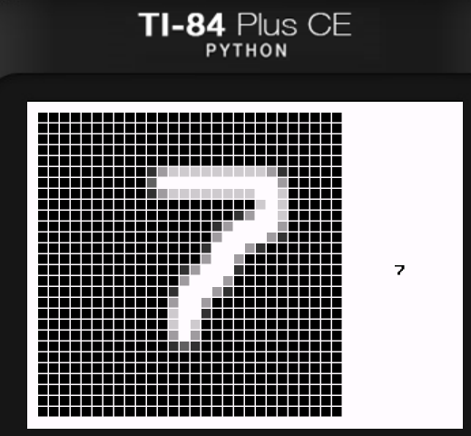
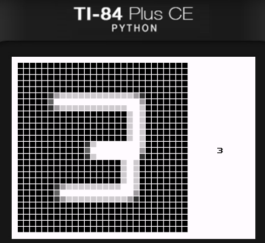
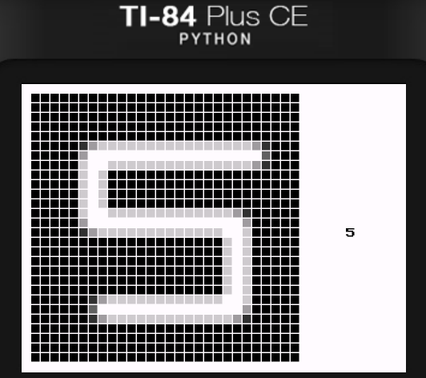

## Overview: 
This is a digit recognizer for TI84 Plus CE calculators written in C and compiled using cedev.  
I first pretrained a basic feedforward fully connected network in pytorch using the MNIST dataset and then put the weights and math into C.  
It is structured with an input layer with 784 neurons, a single hidden layer with 8 neurons, and an output layer with 10 neurons.  
This model was optimized to be as small and lightweight as possible so I could more easily fit it into a calculator.  
I did not use any activation functions because for some reason it performed better without them.  
It sometimes has some issues with guessing the digits but it does well enough.  
It might work with other calculators but I have no idea.  

## How to use:

- Download the latest release and use TI Connect CE to send it over to your calculator.
- Your calculator likely needs to be jailbroken to have the ability to run assembly programs. There are many guides to do this using [arTIfiCE](https://yvantt.github.io/arTIfiCE/).
- Once your calculator has been jailbroken download [CE libraries](https://github.com/CE-Programming/libraries/releases/latest) for your calculator.
- Run DIGITAI.8xp using a arTIfiCE.

#### Controls: 

Use the arrows to move your cursor.  
The clear button clears your drawing.  
(2nd + mode) to quit.  
Sometimes it might not take input but do not panick! Just wait for it to finish evaluating the drawing and try again!

###### This project is not super polished but I just want to finish it

### Here are some examples of the program at work:

